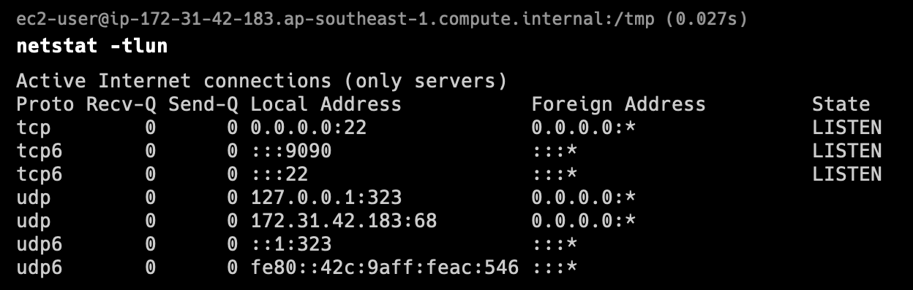
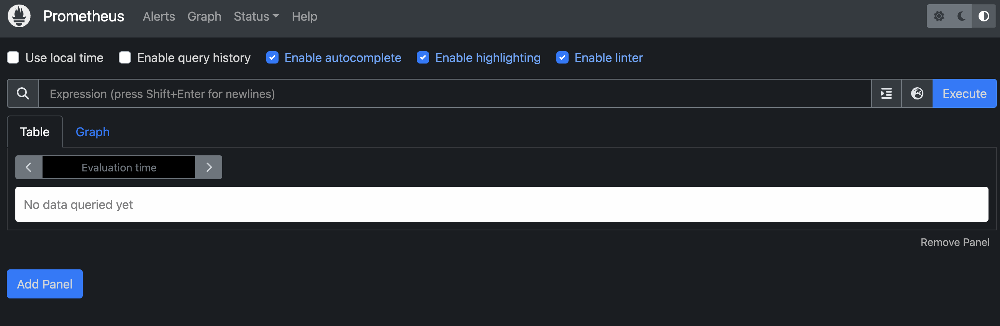

### Set up Prometheus Server

Update the system:
```
sudo yum update -y
```

Create a system user for Prometheus using below commands:
```
sudo useradd --no-create-home --shell /bin/false prometheus
```

Create the directories in which we will be storing our configuration files and libraries with this commands:
```
sudo mkdir /etc/prometheus 
sudo mkdir /var/lib/prometheus
```

Set the ownership of the /var/lib/prometheus directory with below command:
```
sudo chown prometheus:prometheus /var/lib/prometheus
```

You need to inside /tmp :
```
cd /tmp/
```

Download the Prometheus of your desired version. In this example, we shall use V2.45.1: 
```
wget https://github.com/prometheus/prometheus/releases/download/v2.45.1/prometheus-2.45.1.linux-amd64.tar.gz
```

Extract the downloaded file:
```
tar -xzf prometheus-2.45.1.linux-amd64.tar.gz
```

Navigate to the extracted directory:
```
cd prometheus-2.45.1.linux-amd64
```

Move the configuration file and set the owner to the prometheus user:
```
sudo mv console* /etc/prometheus 
sudo mv prometheus.yml /etc/prometheus 
sudo chown -R prometheus:prometheus /etc/prometheus
```

Move the binaries and set the owner:
```
sudo mv prometheus /usr/local/bin/
sudo chown prometheus:prometheus /usr/local/bin/prometheus
```

Create the prometheus service file using below command:
```
sudo nano /etc/systemd/system/prometheus.service
```

Add the following content:
```
[Unit] 
Description=Prometheus 
Wants=network-online.target 
After=network-online.target 

[Service] 
User=prometheus 
Group=prometheus 
Type=simple 
ExecStart=/usr/local/bin/prometheus \ 
    --config.file /etc/prometheus/prometheus.yml \ 
    --storage.tsdb.path /var/lib/prometheus/ \ 
    --web.console.templates=/etc/prometheus/consoles \ 
    --web.console.libraries=/etc/prometheus/console_libraries 
    
[Install] 
WantedBy=multi-user.target
```
Save and close the editor.

Start and enable the Prometheus service:
```
sudo systemctl daemon-reload
sudo systemctl enable prometheus
sudo systemctl start prometheus
```

Verify the status of Prometheus:
```
sudo systemctl status prometheus
```

If there is any error, you can use below command to check for service error log, and try to troubleshoot. (Optional)
```
sudo journalctl -u prometheus
```

You may check for the listening process as well: (optional)


Edit the inbound rules of the security group of VM1 to allow TCP traffic at port 9090. For the source, you may put 0.0.0.0/0 to allow all ip range. (Only application for testing usage, for production workload, will need to indicate the exact ip address range due to security concern)

**Access Prometheus**: 
Prometheus, by default, listens on port 9090. Open a web browser and go to `http://YOUR_EC2_INSTANCE_PUBLIC_IP:9090` to access the Prometheus web interface.


Next we will set up Grafana. 