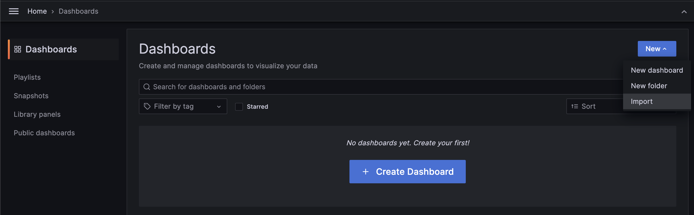

### Set up Grafana

Install Grafana [from the YUM repository](https://grafana.com/docs/grafana/v9.0/setup-grafana/installation/rpm/#install-from-yum-repository).
```
sudo nano /etc/yum.repos.d/grafana.repo
```

After sudo nano, copy and paste below this code.
```
[grafana]
name=grafana
baseurl=https://packages.grafana.com/oss/rpm
repo_gpgcheck=1
enabled=1
gpgcheck=1
gpgkey=https://packages.grafana.com/gpg.key
sslverify=1
sslcacert=/etc/pki/tls/certs/ca-bundle.crt
```

After copy-paste, press **Ctrl + X** then **Y**, and **ENTER**. Now can install Grafana. When asked to choose [y/N] — choose **always** y. After Grafana has already been installed, start Grafana and check Grafana status.

```
sudo yum install grafana

sudo systemctl daemon-reload
sudo systemctl start grafana-server
sudo systemctl status grafana-server
```

After Grafana is now running, enable Grafana.
```
sudo systemctl enable grafana-server
```

Edit the inbound rules of the security group of VM1 to allow TCP traffic at port 3000(which is the default port for Grafana). For the source, you may put 0.0.0.0/0 to allow all ip range. (Only application for testing usage, for production workload, will need to indicate the exact ip address range due to security concern)

Visit "VM1_public_ip:3000" in the browser. Fill the username and password — **admin** and **admin**, then log in. Can skip the password or change the password. For this tutorial, skip the password. Welcome to Grafana finally.


Next, we will configure Grafana to use Prometheus as its data source. 

Back to Grafana. Go to **Connections** and click **Data sources.**


Click **Add data source**, search **Prometheus**, and click **Prometheus** to settings Prometheus.


Fill in the URL-based Prometheus link **but** delete **/metrics** like this screenshot.


We shall keep the rest of the settings as default. Next, you can scroll all the way down and click on "Save & test". 

If successful, it will show a notification "Successfully queried the Prometheus API". Then go to **Explore** section.

Explore means can focus on the query without thinking about visualisation. Focus on the metrics you want to display. Try metric — **prometheus_http_requests_total** and click **Run query**.


If want create dashboard, go to **dashboard** section and click **Import.**


Importing a dashboard is faster step than creating a new dashboard. But instead, creating a new dashboard is good for showing only the metrics that you need. Import dashboard can upload JSON files **or** via Grafana.com dashboard. Import via Grafana.com on [this link](https://grafana.com/grafana/dashboards/3662-prometheus-2-0-overview/), click **Copy ID to the dashboard**, and click **Load.** 

Change name and folder if needed. Data source from Prometheus. Click **Import** and wait until the dashboard is showing.

Next we will set up Alertmanager. 