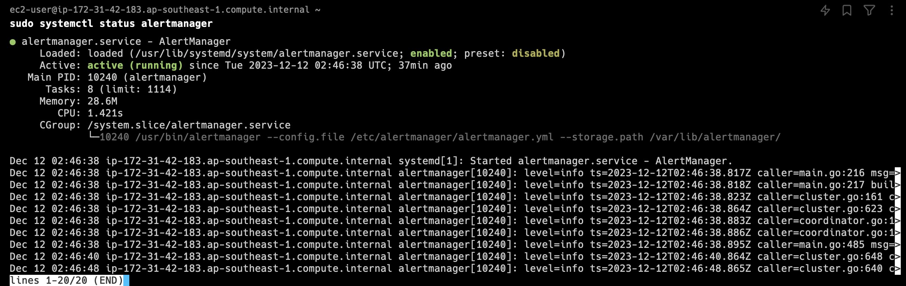
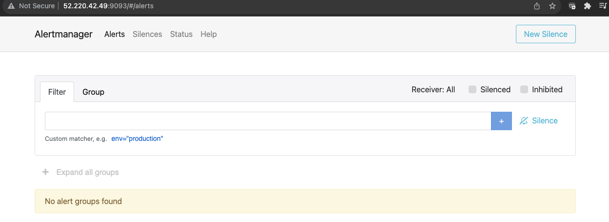
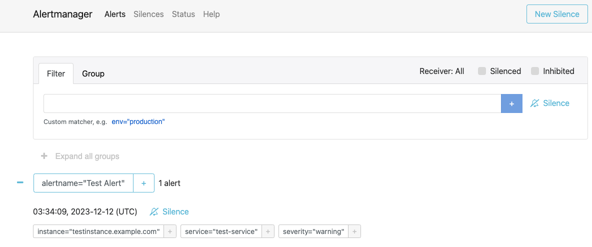

### Set up Alertmanager

Download the AlertManager binary to the server that you will use for alerting.
```
wget https://github.com/prometheus/alertmanager/releases/download/v0.21.0/alertmanager-0.21.0.linux-amd64.tar.gz
```
Visit the Prometheus [downloads page](https://prometheus.io/download/) for the latest version.

Create a alertmanager user, required directories, and make alertmanager user as the owner of those directories.
```
sudo groupadd -f alertmanager
sudo useradd -g alertmanager --no-create-home --shell /bin/false alertmanager
sudo mkdir -p /etc/alertmanager/templates
sudo mkdir /var/lib/alertmanager
sudo chown alertmanager:alertmanager /etc/alertmanager
sudo chown alertmanager:alertmanager /var/lib/alertmanager
```

Untar and move the downloaded Prometheus AlertManager binary
```
tar -xvf alertmanager-0.21.0.linux-amd64.tar.gz
mv alertmanager-0.21.0.linux-amd64 alertmanager-files
```

Copy `alertmanager` and `amtool` binary from alertmanager-files folder to `/usr/bin` and change the ownership to alertmanager user.
```bash
sudo cp alertmanager-files/alertmanager /usr/bin/
sudo cp alertmanager-files/amtool /usr/bin/
sudo chown alertmanager:alertmanager /usr/bin/alertmanager
sudo chown alertmanager:alertmanager /usr/bin/amtool
```

Move the `alertmanager.yml` file from `alertmanager-files` to the `/etc/alertmanager` folder and change the ownership to alertmanager user.
```bash
sudo cp alertmanager-files/alertmanager.yml /etc/alertmanager/alertmanager.yml
sudo chown alertmanager:alertmanager /etc/alertmanager/alertmanager.yml
```

Create an `alertmanager` service file.
```bash
sudo nano /usr/lib/systemd/system/alertmanager.service
```

Add the following configuration and save the file
```bash
[Unit]
Description=AlertManager
Wants=network-online.target
After=network-online.target

[Service]
User=alertmanager
Group=alertmanager
Type=simple
ExecStart=/usr/bin/alertmanager \
    --config.file /etc/alertmanager/alertmanager.yml \
    --storage.path /var/lib/alertmanager/

[Install]
WantedBy=multi-user.target
```

```bash
sudo chmod 664 /usr/lib/systemd/system/alertmanager.service
```

Reload the `systemd` service to register and Start the Prometheus AlertManager service.
```bash
sudo systemctl daemon-reload
sudo systemctl start alertmanager
```

Check the `alertmanager` service status using the following command.
```bash
sudo systemctl status alertmanager
```



Configure Prometheus AlertManager to start at boot
```bash
sudo systemctl enable alertmanager.service
```

Edit the inbound rules of the security group of VM1 to allow TCP traffic at port 9093. For the source, you may put 0.0.0.0/0 to allow all ip range. (Only application for testing usage, for production workload, will need to indicate the exact ip address range due to security concern)

Now you will be able to access the AlertManager UI on `9093` port of the alertmanager server.
```bash
http://<alertmanager-ip>:9093
```

You should be able to see the following UI as shown below.


Setup a Prometheus AlertManager Test Alert
Execute the following statement, be sure to replace `<alertmanager-ip>` with the IP address / hostname of your AlertManager instance. If you are ssh'd into the AlertManager server already you can use `localhost`.

```bash
curl -XPOST "http://<alertmanager-ip>:9093/api/v1/alerts" \
  -d \
  "[{
    \"status\": \"firing\",
    \"labels\": {
      \"alertname\": \"Test Alert\",
      \"service\": \"test-service\",
      \"severity\":\"warning\",
      \"instance\": \"testinstance.example.com\"
    },
    \"annotations\": {
      \"summary\": \"High latency is high!\"
    }
  }]"
```

Open the AlertManager UI in a web browser
```bash
http://<alertmanager-ip>:9093
```

You should be able to see your test alert in the UI as shown below.


Prometheus automatically takes care of sending alerts generated by its configured alerting rules, it is not recommended to generate alerts by calling the AlertManager APIs directly.

Clean Up
Remove the download and temporary files
```bash
rm -rf alertmanager-0.21.0.linux-amd64.tar.gz alertmanager-files
```

Next we will set up Pushgateway.