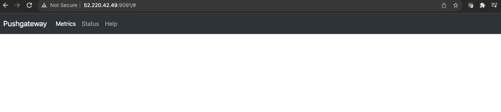
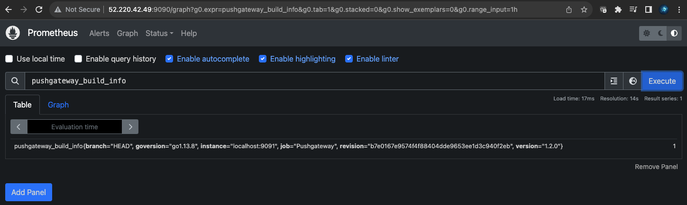

### Set up Pustgateway

Create a user and group for Pushgateway
```bash
sudo useradd -M -r -s /bin/false pushgateway
```

Download and install the Pushgateway binary
```bash
wget https://github.com/prometheus/pushgateway/releases/download/v1.2.0/pushgateway-1.2.0.linux-amd64.tar.gz

tar xvfz pushgateway-1.2.0.linux-amd64.tar.gz

sudo cp pushgateway-1.2.0.linux-amd64/pushgateway /usr/local/bin/

sudo chown pushgateway:pushgateway /usr/local/bin/pushgateway
```

Create a `systemd` unit file for Pushgateway
```bash
sudo vi /etc/systemd/system/pushgateway.service
```

```bash
[Unit]
Description=Prometheus Pushgateway
Wants=network-online.target
After=network-online.target

[Service]
User=pushgateway
Group=pushgateway
Type=simple
ExecStart=/usr/local/bin/pushgateway

[Install]
WantedBy=multi-user.target
```

Start and enable the `pushgateway` service
```
sudo systemctl enable pushgateway
```

```
sudo systemctl start pushgateway
```

Verify the service is running and serving metrics
```
sudo systemctl status pushgateway
```

Edit the inbound rules of the security group of VM1 to allow TCP traffic at port 9091 For the source, you may put 0.0.0.0/0 to allow all ip range. (Only application for testing usage, for production workload, will need to indicate the exact ip address range due to security concern)

Now you will be able to access the Pushgateway UI on `9091` port of the Pushgateway server
```bash
http://<pushgateway-ip>:9091
```



Configure Pushgateway as a Scrape Target for Prometheus Server
Edit the Prometheus config
```
sudo nano /etc/prometheus/prometheus.yml
```

Under the `scrape_configs` section, add a scrape configuration for Pushgateway. Be sure to set `honor_labels: true`
```
  - job_name: "Pushgateway"
    honor_labels: true
    static_configs:
      - targets: ["localhost:9091"]
```

Restart Prometheus to load the new configuration
```
sudo systemctl restart prometheus
```

Use expression browser to verify you can see Pushgateway metrics in Prometheus. You can access expression browser in a web browser at `http://<PROMETHEUS_SERVER_PUBLIC_IP>:9090`

Run a query to view some Pushgateway metric data
```
pushgateway_build_info
```



Next we will set up service discovery. 