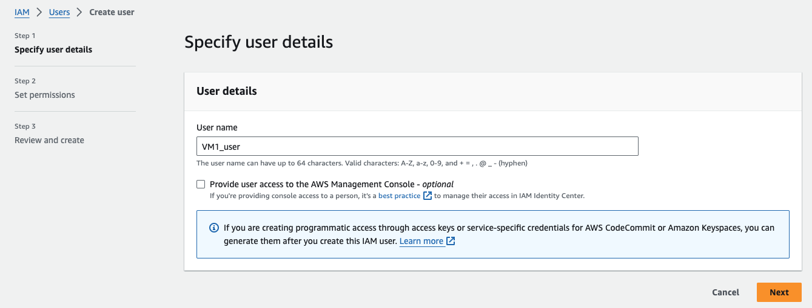

### Set up Service Discovery

Setting up service discovery in Prometheus on an Amazon Linux machine involves several steps. The process can vary depending on the specific service discovery mechanism you're using (e.g., EC2, Kubernetes, Consul, etc.). Below, I'll outline a general approach for setting up service discovery with Prometheus, focusing on EC2 service discovery as an example.

Ensure the machine where Prometheus is running has the necessary AWS permissions to discover EC2 instances. This usually means attaching an IAM role with EC2 read permissions.

First, select **IAM** from the AWS Services using the search bar.
Select **Users** from the sidebar menu.
Click on **Add user** button.


Set user details. Pick a name of your preference for the new user. Also, our user will not login to AWS Console. Click on **next**. 


Next, we will need to attached a **AmazonEC2ReadOnlyAccess** policy to the user. Then, click **next**.


Review the user. If everything is okay, click **Create user**.


Then, go to the newly created user, and click on **Create access key**. 


Choose **Application running on an AWS compute service**, and click **Next**.


Next, save the credentials in a safe place. It is really important to keep these values in a safe place. With these credentials anyone could use your AWS account and generate bills.

Next will need to configure Prometheus Service Discovery. 
Edit `/etc/prometheus/prometheus.yml` file. Notice the `region` property, this could be different in your setup.
```
scrape_configs: 
  - job_name: 'service discovery'
    ec2_sd_configs:
      - region: 'us-west-1' 
        access_key: 'YOUR_ACCESS_KEY' 
        secret_key: 'YOUR_SECRET_KEY' 
        port: 9100
```

Restart Prometheus service.
```
sudo systemctl restart prometheus
```

Next, launch another ec2 instance in the same region. Let's named it as `VM2`. 
We will also need to associate a EIP to VM2. (So that its public ip will not change whenever we start or stop the vm to save cost)
Also need to create a security group and associate it to VM2. 
Next, we will need to install node_exporter in VM2.