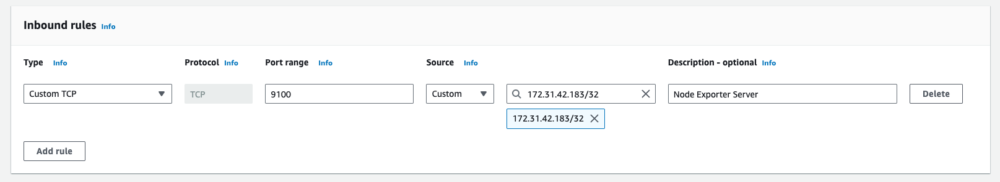
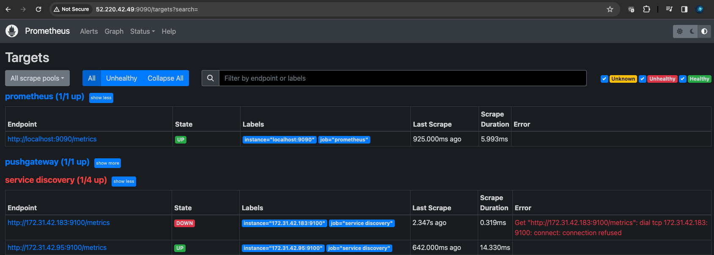

### Set up Node-exporter in VM2 

Step 1: Connect to Your EC2 Instance
First, SSH into your EC2 instance. Replace `your-key.pem` with your key file, and `your-instance-ip` with your EC2 instance's public IP address or DNS name.

```
ssh -i /path/to/your-key.pem ec2-user@your-instance-ip
```

Step 2: Download Node Exporter
Download the latest version of Node Exporter. You can find the latest release on the [Node Exporter GitHub page](https://github.com/prometheus/node_exporter/releases). As of my last update, let's assume the latest version is `1.2.2`, but you should check for the latest version.

```
wget https://github.com/prometheus/node_exporter/releases/download/v1.2.2/node_exporter-1.2.2.linux-amd64.tar.gz
```

Step 3: Extract the Files
Extract the downloaded file.
```
tar xvfz node_exporter-1.2.2.linux-amd64.tar.gz
```

Step 4: Move the Binary
Move the `node_exporter` binary to a suitable location. `/usr/local/bin` is a common choice.
```
sudo mv node_exporter-1.2.2.linux-amd64/node_exporter /usr/local/bin/
```

Step 5: Create a Systemd Service
To make Node Exporter run as a service, you'll need to create a systemd service file.

Create a new systemd service file:
```
sudo nano /etc/systemd/system/node_exporter.service
```

Add the following content to the file:
```
[Unit]
Description=Node Exporter
Wants=network-online.target
After=network-online.target

[Service]
User=node_exporter
Group=node_exporter
Type=simple
ExecStart=/usr/local/bin/node_exporter

[Install]
WantedBy=multi-user.target
```

Save and exit the editor (in nano, press `CTRL+X`, then `Y` and `Enter`).

Step 6: Create User for Node Exporter
It's a good security practice to run services with a dedicated user.
```
sudo useradd -rs /bin/false node_exporter
```

Step 7: Reload Systemd and Start the Service
Reload systemd to apply the new service file:
```
sudo systemctl daemon-reload
```

Start Node Exporter:
```
sudo systemctl start node_exporter
```

Enable Node Exporter to start on boot:
```
sudo systemctl enable node_exporter
```

Step 8: Verify that Node Exporter is Running
Check the status of the Node Exporter service:
```
sudo systemctl status node_exporter
```

Step 9: Update Security Group Rules
Ensure your EC2 instance's security group allows inbound traffic on port 9100, as this is the default port used by Node Exporter. Change the below source ip address to the prometheus server's node ip address. 


Step 10: Configure Prometheus to Scrape Node Exporter
Finally, you'll need to configure Prometheus to scrape metrics from Node Exporter. If you are using *static_configs*, add the following job to your Prometheus configuration (`prometheus.yml`). Replace `your-ec2-instance-ip` with the IP address of your EC2 instance. Restart Prometheus to apply these changes. However, since we are using service discovery in the above section, Prometheus should be able to automatically discover our newly created VM2, and start scraping the node-exporter metrics. 
```
scrape_configs:
  - job_name: 'node'
    static_configs:
    - targets: ['your-ec2-instance-ip:9100']
```

The http://172.31.42.183:9100/metrics is currently down as the VM1 node is not currently running exporter-node server. 



By following these steps, you will have Node Exporter installed and running on your EC2 instance, ready to be scraped by Prometheus for system metrics monitoring.

Next, we will set up a python application in VM2, in order to demonstrate that prometheus is able to scrape python app's metrics as well. 