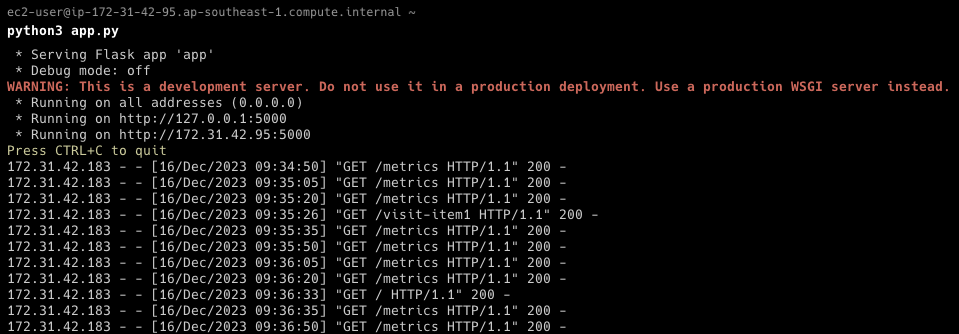
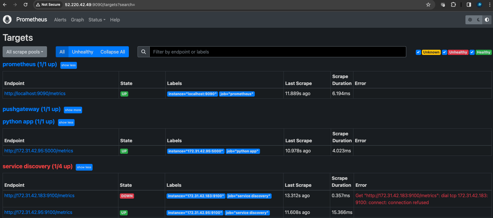
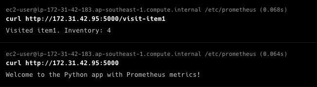
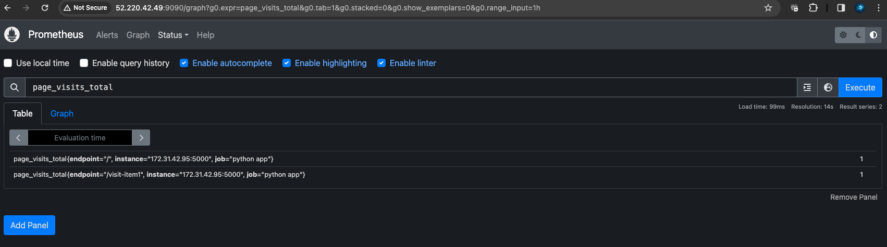

### Set up Python App 

**Install Python and Pip:**
**Update Your System**:
- Open a terminal and update your package manager:
```
sudo yum update -y
```

**Check for Pre-installed Python Versions**:
- Check which versions of Python are already installed:
```
python --version
python3 --version
```

**Install Python 3.x** (if a different version of Python 3 is needed):
- Amazon Linux 2 has Python 3 available in its repositories. You can install it directly:
```
sudo yum install python3 -y
```

**Verify Python Installation**:
- After installation, verify the Python version:
```
python3 --version
```

**Install Pip on Amazon Linux**
Pip is included by default when you install Python 3 from Amazon Linux’s repository. If for some reason it's not installed, you can install it using:
```
sudo yum install python3-pip -y
```

**Verify Pip Installation**:
- Check the installed Pip version:
```
pip3 --version
```

**Upgrade Pip** (Optional):
- Upgrade Pip to the latest version:
```
pip3 install --upgrade pip
```

**Create a Python Application**:
- You can create a simple Python application using Flask and `prometheus_flask_exporter` to expose metrics.
- Install Flask and `prometheus_flask_exporter`:
```
pip3 install Flask prometheus_flask_exporter
```

**Create a Python Application with Custom Metrics**
 - Create Your Python Application (`app.py`):
 - This application will have two endpoints and two custom metrics: a counter and a gauge.

```
from flask import Flask
from prometheus_flask_exporter import PrometheusMetrics
from prometheus_client import Counter, Gauge

app = Flask(__name__)
metrics = PrometheusMetrics(app)

# Custom metric - Counter
visit_counter = Counter(
    'page_visits', 'Number of visits to the page', ['endpoint']
)

# Custom metric - Gauge
inventory_gauge = Gauge(
    'inventory', 'Current inventory level', ['item']
)

# Initialize inventory for demonstration
inventory = {
    'item1': 5,
    'item2': 10
}

@app.route('/')
def main():
    visit_counter.labels(endpoint='/').inc()  # Increment counter
    return "Welcome to the Python app with Prometheus metrics!"

@app.route('/visit-item1')
def visit_item1():
    visit_counter.labels(endpoint='/visit-item1').inc()  # Increment counter
    inventory['item1'] -= 1  # Simulate an inventory change
    inventory_gauge.labels(item='item1').set(inventory['item1'])  # Update gauge
    return f"Visited item1. Inventory: {inventory['item1']}"

if __name__ == '__main__':
    app.run(host='0.0.0.0', port=5000)
```

**Run the Application**:
Execute the script to start your Flask application:
```
python3 app.py
```

This application now exposes two custom metrics:

- `page_visits`: A counter that increases every time either the main page or the `/visit-item1` endpoint is visited.
- `inventory`: A gauge that reflects the current level of inventory for `item1`, which decreases every time `/visit-item1` is visited.

**Ensure Prometheus is Configured to Scrape Metrics**
On your Prometheus server (VM1), make sure you have the following job in your `prometheus.yml`:

```
scrape_configs:
  - job_name: 'python_app'
    static_configs:
      - targets: ['[Instance 2 IP or DNS]:5000']
```

**Interact with Your Application and Observe Metrics**

**Access Your Python Application**: Visit the main page and `/visit-item1` endpoint of your Flask application through a web browser or using a tool like `curl`.
    
**View Metrics in Prometheus**: Go to your Prometheus UI (`http://[Instance 1 IP or DNS]:9090`) and use the metrics explorer to view `page_visits` and `inventory` metrics.

By following these steps, your Python application will not only expose default metrics from `prometheus_flask_exporter` but also custom metrics that you define, which Prometheus can then scrape and monitor.

Picture below shows python app running. 


Picture below shows python app was scraped by Prometheus server.  


Picture below shows running curl command from VM1. 


Picture below shows result from querying `page_visits_total`. 


Next, I will demonstrate pushing metrics from short lived job in VM2 to Pushgateway in VM1. 