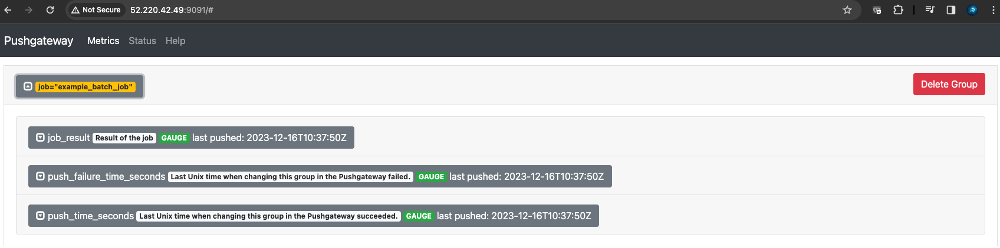
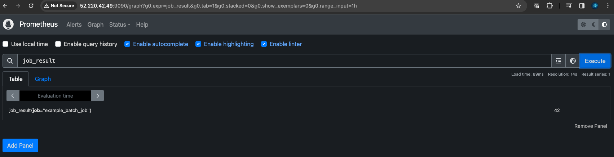

### Creating a Python script for a short-lived job and push its metrics to Pushgateway

Here's an example Python script that performs a simple job and pushes metrics to the Pushgateway:
```
from prometheus_client import CollectorRegistry, Gauge, push_to_gateway

def perform_job():
    # Simulate a job, e.g., processing data, performing a calculation, etc.
    import time
    time.sleep(2)  # Simulate some work
    return 42  # Return some result

def push_metrics(job_result):
    registry = CollectorRegistry()
    g = Gauge('job_result', 'Result of the job', registry=registry)
    g.set(job_result)  # Set to the result of your job
    
    # Push metrics to the Pushgateway
    push_to_gateway('http://your-pushgateway-address:9091', job='example_batch_job', registry=registry)

if __name__ == "__main__":
    result = perform_job()
    push_metrics(result)
```
Replace `http://your-pushgateway-address:9091` with the actual address of your Pushgateway.

**Run Your Python Script**:
- Execute the script. It will perform the job and push the metrics to the Pushgateway.

**Verifying the Metrics**
- After running the script, you can check if the metrics were successfully pushed by visiting the Pushgateway's web interface: `http://your-pushgateway-address:9091`.


Below picture shows metrics from pushgateway is successfully scraped by prometheus server. 


This example demonstrates the ability to instrument a Python application with Prometheus metrics and use Pushgateway to handle metrics from short-lived jobs.

Lastly, we will use prometheus to set up alert for a particular metric. The alertmanager will also be sending out gmail email to corresponding receiver. 