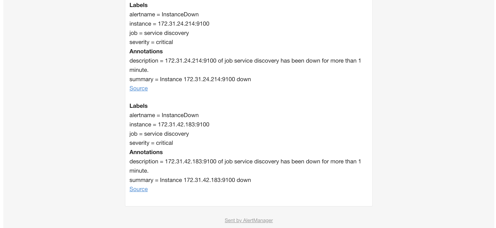

### Set up monitoring and alerting with prometheus & alertmanager, via gmail email. 

#### Overview
1. **VM1**: Runs Prometheus and Alertmanager.
2. **VM2**: Runs Node Exporter to collect system metrics.
3. **Alertmanager**: Configured to send alerts to Gmail.
4. **Node Exporter**: Provides metrics to Prometheus.

#### Step 1: Set Up EC2 Instances

Launch two EC2 instances in AWS. Instance 1 will run Prometheus and Alertmanager, while Instance 2 will run Node Exporter. Already setup previously. 

#### Step 2: Install and Configure Node Exporter on EC2 Instance 2

**Install Node Exporter**:
- SSH into Instance 2 and install Node Exporter. You can download the latest version from the [Node Exporter GitHub releases](https://github.com/prometheus/node_exporter/releases) page.
- Run Node Exporter. 
```
./node_exporter
```
Already setup previously. 

**Ensure Accessibility**:
- Make sure Node Exporter is accessible from Instance 1 (adjust security groups if necessary).

#### Step 3: Install and Configure Prometheus on EC2 Instance 1

1. **Install Prometheus**:
    - SSH into Instance 1.
    - Download and install Prometheus from the [official website](https://prometheus.io/download/).
2. **Configure Prometheus**:
    - Edit `prometheus.yml` to add Node Exporter as a target. Example configuration:
```
global:
  scrape_interval: 15s

scrape_configs:
  - job_name: 'node'
    static_configs:
      - targets: ['<instance-2-ip>:9100']
```
   - Replace `<instance-2-ip>` with the IP address of Instance 2.
   - However, we have already used service discovery to discover VM2. So there is no need to statically define here. 

**Start Prometheus**:
- Run Prometheus using the configuration file:
```
./prometheus --config.file=prometheus.yml

```
- Or just start the Prometheus service, as we have already previously setup. 

#### Step 4: Install and Configure Alertmanager on EC2 Instance 1

1. **Install Alertmanager**:
    - Download and install Alertmanager from the [official website](https://prometheus.io/download/#alertmanager).
2. **Configure Alertmanager for Gmail**:
    - Create a `alertmanager.yml` configuration file for sending alerts to Gmail:

```
global:
  resolve_timeout: 5m
  smtp_smarthost: 'smtp.gmail.com:587'
  smtp_from: 'your-email@gmail.com'
  smtp_auth_username: 'your-email@gmail.com'
  smtp_auth_identity: 'your-email@gmail.com'
  smtp_auth_password: 'your-app-password'

route:
  receiver: 'gmail-notifications'
  repeat_interval: 3h
  group_interval: 10m
  group_wait: 10s

receivers:
  - name: 'gmail-notifications'
    email_configs:
      - to: 'recipient-email@example.com'
```
- Replace `your-email@gmail.com` and `recipient-email@example.com` with your actual email addresses. Use a [Gmail App Password](https://support.google.com/accounts/answer/185833).

3. **Start Alertmanager**:
   - Run Alertmanager:
```
./alertmanager --config.file=alertmanager.yml
```
   - Or just start the Alertmanager service, as we have already previously setup. 

#### Step 5: Create Alerting Rules in Prometheus

1. **Define Alerting Rules**:
    - Create a file, e.g., `alerting_rules.yml`, and define some alerting rules. For example, an alert for when nodes are down:
```
groups:
  - name: instance_down
    rules:
      - alert: InstanceDown
        expr: up == 0
        for: 1m
        labels:
          severity: "critical"
        annotations:
          summary: "Instance {{ $labels.instance }} down"
          description: "{{ $labels.instance }} of job {{ $labels.job }} has been down for more than 1 minute."
```

2. **Add the Rule File to Prometheus Configuration**:
    - Include this rules file in your `prometheus.yml`.
```
rule_files:
  - "alerting_rules.yml"
```

### Step 6: Test Your Setup

- **Trigger an Alert**: You can simulate VM2 node is down by either stopping the ec2 instance in aws console, or by stopping the node-exporter service with:
```
sudo systemctl stop node_exporter
```
  
- **Check Gmail**: Verify that you receive the alert notification in your Gmail.

Example in Prometheus > Targets. 


Example in Prometheus > Alerts. 


Example in Alertmanager > Alerts. 


Example email in Gmail. 


