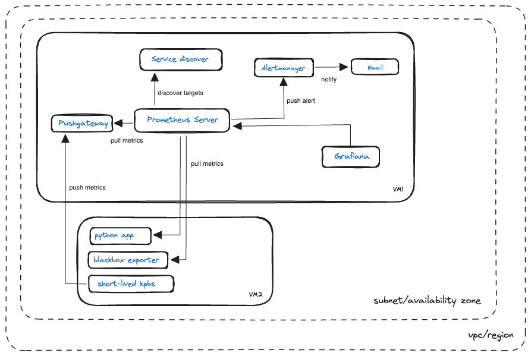

In this documentation, i am going to detail the entire process of installing and configuring Prometheus, Grafana, and its related technologies in EC2 instances in AWS. 
We also have an example python app as well, to illustrate the instrumentation of python app, to expose its metrics to the prometheus server, so that prometheus can monitor it by scraping its metric on a regular interval. 

Without further ado, let's get started.. 

Let's look at the entire architecture diagram first. 


Below will list down the steps on how to configure the above architecture. 

Launch two EC2 instances in AWS. They can be in the same region and subnet. Use Amazon Linux AMI for your instances. For security group, create a new security group for each instance, and associate to each instance. The security groups should allow ssh access at port 22 from anywhere(0.0.0.0). We will configure as allow from any source first. We can then modify in future to only allow from certain ip/ ip range to enhance security.

Create a key pair in AWS. Save the private key with the .pem extension in your local environment. We will need to use it to ssh into our ec2 instances later. 

Create two EIPs and associate to your two vms. So that their public ip will not change everytime it is stop and start. 

Run the ssh command that is something like that to connect to your vm. Remember to replace the below content accordingly. 
```
ssh -i "<private_key_name>.pem" ec2-user@<replace_with_your_respective_public_dns>
```

We will then configure the VM1 first. By setting up Prometheus server --> Alertmanager --> Grafana --> Service Discover --> Pushgateway

Note that you may choose to skip or not set up any of the above software/tools. It should be based on your specific use case, and shouldn't be cast in stone.  

With that in mind, let's continue. 

### Set up Prometheus Server

Update the system:
```
sudo yum update -y
```

Create a system user for Prometheus using below commands:
```
sudo useradd --no-create-home --shell /bin/false prometheus
```

Create the directories in which we will be storing our configuration files and libraries with this commands:
```
sudo mkdir /etc/prometheus 
sudo mkdir /var/lib/prometheus
```

Set the ownership of the /var/lib/prometheus directory with below command:
```
sudo chown prometheus:prometheus /var/lib/prometheus
```

You need to inside /tmp :
```
cd /tmp/
```

Download the Prometheus of your desired version. In this example, we shall use V2.45.1: 
```
wget https://github.com/prometheus/prometheus/releases/download/v2.45.1/prometheus-2.45.1.linux-amd64.tar.gz
```

Extract the downloaded file:
```
tar -xzf prometheus-2.45.1.linux-amd64.tar.gz
```

Navigate to the extracted directory:
```
cd prometheus-2.45.1.linux-amd64
```

Move the configuration file and set the owner to the prometheus user:
```
sudo mv console* /etc/prometheus 
sudo mv prometheus.yml /etc/prometheus 
sudo chown -R prometheus:prometheus /etc/prometheus
```

Move the binaries and set the owner:
```
sudo mv prometheus /usr/local/bin/
sudo chown prometheus:prometheus /usr/local/bin/prometheus
```

Create the prometheus service file using below command:
```
sudo nano /etc/systemd/system/prometheus.service
```

Add the following content:
```
[Unit] 
Description=Prometheus 
Wants=network-online.target 
After=network-online.target 

[Service] 
User=prometheus 
Group=prometheus 
Type=simple 
ExecStart=/usr/local/bin/prometheus \ 
    --config.file /etc/prometheus/prometheus.yml \ 
    --storage.tsdb.path /var/lib/prometheus/ \ 
    --web.console.templates=/etc/prometheus/consoles \ 
    --web.console.libraries=/etc/prometheus/console_libraries 
    
[Install] 
WantedBy=multi-user.target
```
Save and close the editor.

Start and enable the Prometheus service:
```
sudo systemctl daemon-reload
sudo systemctl enable prometheus
sudo systemctl start prometheus
```

Verify the status of Prometheus:
```
sudo systemctl status prometheus
```

If there is any error, you can use below command to check for service error log, and try to troubleshoot. (Optional)
```
sudo journalctl -u prometheus
```

You may check for the listening process as well: (optional)


Edit the inbound rules of the security group of VM1 to allow TCP traffic at port 9090. For the source, you may put 0.0.0.0/0 to allow all ip range. (Only application for testing usage, for production workload, will need to indicate the exact ip address range due to security concern)

**Access Prometheus**: 
Prometheus, by default, listens on port 9090. Open a web browser and go to `http://YOUR_EC2_INSTANCE_PUBLIC_IP:9090` to access the Prometheus web interface.


Next we will set up Grafana. 

### Set up Grafana

Install Grafana [from the YUM repository](https://grafana.com/docs/grafana/v9.0/setup-grafana/installation/rpm/#install-from-yum-repository).
```
sudo nano /etc/yum.repos.d/grafana.repo
```

After sudo nano, copy and paste below this code.
```
[grafana]
name=grafana
baseurl=https://packages.grafana.com/oss/rpm
repo_gpgcheck=1
enabled=1
gpgcheck=1
gpgkey=https://packages.grafana.com/gpg.key
sslverify=1
sslcacert=/etc/pki/tls/certs/ca-bundle.crt
```

After copy-paste, press **Ctrl + X** then **Y**, and **ENTER**. Now can install Grafana. When asked to choose [y/N] — choose **always** y. After Grafana has already been installed, start Grafana and check Grafana status.

```
sudo yum install grafana

sudo systemctl daemon-reload
sudo systemctl start grafana-server
sudo systemctl status grafana-server
```

After Grafana is now running, enable Grafana.
```
sudo systemctl enable grafana-server
```

Edit the inbound rules of the security group of VM1 to allow TCP traffic at port 3000(which is the default port for Grafana). For the source, you may put 0.0.0.0/0 to allow all ip range. (Only application for testing usage, for production workload, will need to indicate the exact ip address range due to security concern)

Visit "VM1_public_ip:3000" in the browser. Fill the username and password — **admin** and **admin**, then log in. Can skip the password or change the password. For this tutorial, skip the password. Welcome to Grafana finally.


Next, we will configure Grafana to use Prometheus as its data source. 

Back to Grafana. Go to **Connections** and click **Data sources.**


Click **Add data source**, search **Prometheus**, and click **Prometheus** to settings Prometheus.


Fill in the URL-based Prometheus link **but** delete **/metrics** like this screenshot.


We shall keep the rest of the settings as default. Next, you can scroll all the way down and click on "Save & test". 

If successful, it will show a notification "Successfully queried the Prometheus API". Then go to **Explore** section.

Explore means can focus on the query without thinking about visualisation. Focus on the metrics you want to display. Try metric — **prometheus_http_requests_total** and click **Run query**.


If want create dashboard, go to **dashboard** section and click **Import.**


Importing a dashboard is faster step than creating a new dashboard. But instead, creating a new dashboard is good for showing only the metrics that you need. Import dashboard can upload JSON files **or** via Grafana.com dashboard. Import via Grafana.com on [this link](https://grafana.com/grafana/dashboards/3662-prometheus-2-0-overview/), click **Copy ID to the dashboard**, and click **Load.** 

Change name and folder if needed. Data source from Prometheus. Click **Import** and wait until the dashboard is showing.

Next we will set up Alertmanager. 

### Set up Alertmanager

Download the AlertManager binary to the server that you will use for alerting.
```
wget https://github.com/prometheus/alertmanager/releases/download/v0.21.0/alertmanager-0.21.0.linux-amd64.tar.gz
```
Visit the Prometheus [downloads page](https://prometheus.io/download/) for the latest version.

Create a alertmanager user, required directories, and make alertmanager user as the owner of those directories.
```
sudo groupadd -f alertmanager
sudo useradd -g alertmanager --no-create-home --shell /bin/false alertmanager
sudo mkdir -p /etc/alertmanager/templates
sudo mkdir /var/lib/alertmanager
sudo chown alertmanager:alertmanager /etc/alertmanager
sudo chown alertmanager:alertmanager /var/lib/alertmanager
```

Untar and move the downloaded Prometheus AlertManager binary
```
tar -xvf alertmanager-0.21.0.linux-amd64.tar.gz
mv alertmanager-0.21.0.linux-amd64 alertmanager-files
```

Copy `alertmanager` and `amtool` binary from alertmanager-files folder to `/usr/bin` and change the ownership to alertmanager user.
```bash
sudo cp alertmanager-files/alertmanager /usr/bin/
sudo cp alertmanager-files/amtool /usr/bin/
sudo chown alertmanager:alertmanager /usr/bin/alertmanager
sudo chown alertmanager:alertmanager /usr/bin/amtool
```

Move the `alertmanager.yml` file from `alertmanager-files` to the `/etc/alertmanager` folder and change the ownership to alertmanager user.
```bash
sudo cp alertmanager-files/alertmanager.yml /etc/alertmanager/alertmanager.yml
sudo chown alertmanager:alertmanager /etc/alertmanager/alertmanager.yml
```

Create an `alertmanager` service file.
```bash
sudo nano /usr/lib/systemd/system/alertmanager.service
```

Add the following configuration and save the file
```bash
[Unit]
Description=AlertManager
Wants=network-online.target
After=network-online.target

[Service]
User=alertmanager
Group=alertmanager
Type=simple
ExecStart=/usr/bin/alertmanager \
    --config.file /etc/alertmanager/alertmanager.yml \
    --storage.path /var/lib/alertmanager/

[Install]
WantedBy=multi-user.target
```

```bash
sudo chmod 664 /usr/lib/systemd/system/alertmanager.service
```

Reload the `systemd` service to register and Start the Prometheus AlertManager service.
```bash
sudo systemctl daemon-reload
sudo systemctl start alertmanager
```

Check the `alertmanager` service status using the following command.
```bash
sudo systemctl status alertmanager
```


Configure Prometheus AlertManager to start at boot
```bash
sudo systemctl enable alertmanager.service
```

Edit the inbound rules of the security group of VM1 to allow TCP traffic at port 9093. For the source, you may put 0.0.0.0/0 to allow all ip range. (Only application for testing usage, for production workload, will need to indicate the exact ip address range due to security concern)

Now you will be able to access the AlertManager UI on `9093` port of the alertmanager server.
```bash
http://<alertmanager-ip>:9093
```

You should be able to see the following UI as shown below.


Setup a Prometheus AlertManager Test Alert
Execute the following statement, be sure to replace `<alertmanager-ip>` with the IP address / hostname of your AlertManager instance. If you are ssh'd into the AlertManager server already you can use `localhost`.

```bash
curl -XPOST "http://<alertmanager-ip>:9093/api/v1/alerts" \
  -d \
  "[{
    \"status\": \"firing\",
    \"labels\": {
      \"alertname\": \"Test Alert\",
      \"service\": \"test-service\",
      \"severity\":\"warning\",
      \"instance\": \"testinstance.example.com\"
    },
    \"annotations\": {
      \"summary\": \"High latency is high!\"
    }
  }]"
```

Open the AlertManager UI in a web browser
```bash
http://<alertmanager-ip>:9093
```

You should be able to see your test alert in the UI as shown below.


Prometheus automatically takes care of sending alerts generated by its configured alerting rules, it is not recommended to generate alerts by calling the AlertManager APIs directly.

Clean Up
Remove the download and temporary files
```bash
rm -rf alertmanager-0.21.0.linux-amd64.tar.gz alertmanager-files
```

Next we will set up Pushgateway

### Set up Pustgateway

Create a user and group for Pushgateway
```bash
sudo useradd -M -r -s /bin/false pushgateway
```

Download and install the Pushgateway binary
```bash
wget https://github.com/prometheus/pushgateway/releases/download/v1.2.0/pushgateway-1.2.0.linux-amd64.tar.gz

tar xvfz pushgateway-1.2.0.linux-amd64.tar.gz

sudo cp pushgateway-1.2.0.linux-amd64/pushgateway /usr/local/bin/

sudo chown pushgateway:pushgateway /usr/local/bin/pushgateway
```

Create a `systemd` unit file for Pushgateway
```bash
sudo vi /etc/systemd/system/pushgateway.service
```

```bash
[Unit]
Description=Prometheus Pushgateway
Wants=network-online.target
After=network-online.target

[Service]
User=pushgateway
Group=pushgateway
Type=simple
ExecStart=/usr/local/bin/pushgateway

[Install]
WantedBy=multi-user.target
```

Start and enable the `pushgateway` service
```
sudo systemctl enable pushgateway
```

```
sudo systemctl start pushgateway
```

Verify the service is running and serving metrics
```
sudo systemctl status pushgateway
```

Edit the inbound rules of the security group of VM1 to allow TCP traffic at port 9091 For the source, you may put 0.0.0.0/0 to allow all ip range. (Only application for testing usage, for production workload, will need to indicate the exact ip address range due to security concern)

Now you will be able to access the Pushgateway UI on `9091` port of the Pushgateway server
```bash
http://<pushgateway-ip>:9091
```


Configure Pushgateway as a Scrape Target for Prometheus Server
Edit the Prometheus config
```
sudo nano /etc/prometheus/prometheus.yml
```

Under the `scrape_configs` section, add a scrape configuration for Pushgateway. Be sure to set `honor_labels: true`
```
  - job_name: "Pushgateway"
    honor_labels: true
    static_configs:
      - targets: ["localhost:9091"]
```

Restart Prometheus to load the new configuration
```
sudo systemctl restart prometheus
```

Use expression browser to verify you can see Pushgateway metrics in Prometheus. You can access expression browser in a web browser at `http://<PROMETHEUS_SERVER_PUBLIC_IP>:9090`

Run a query to view some Pushgateway metric data
```
pushgateway_build_info
```


Next we will set up service discovery. 

### Set up Service Discovery

Setting up service discovery in Prometheus on an Amazon Linux machine involves several steps. The process can vary depending on the specific service discovery mechanism you're using (e.g., EC2, Kubernetes, Consul, etc.). Below, I'll outline a general approach for setting up service discovery with Prometheus, focusing on EC2 service discovery as an example.

Ensure the machine where Prometheus is running has the necessary AWS permissions to discover EC2 instances. This usually means attaching an IAM role with EC2 read permissions.

First, select **IAM** from the AWS Services using the search bar.
Select **Users** from the sidebar menu.
Click on **Add user** button.


Set user details. Pick a name of your preference for the new user. Also, our user will not login to AWS Console. Click on **next**. 


Next, we will need to attached a **AmazonEC2ReadOnlyAccess** policy to the user. Then, click **next**.


Review the user. If everything is okay, click **Create user**.


Then, go to the newly created user, and click on **Create access key**. 


Choose **Application running on an AWS compute service**, and click **Next**.


Next, save the credentials in a safe place. It is really important to keep these values in a safe place. With these credentials anyone could use your AWS account and generate bills.

Next will need to configure Prometheus Service Discovery. 
Edit `/etc/prometheus/prometheus.yml` file. Notice the `region` property, this could be different in your setup.
```
scrape_configs: 
  - job_name: 'service discovery'
    ec2_sd_configs:
      - region: 'us-west-1' 
        access_key: 'YOUR_ACCESS_KEY' 
        secret_key: 'YOUR_SECRET_KEY' 
        port: 9100
```

Restart Prometheus service.
```
sudo systemctl restart prometheus
```

Next, launch another ec2 instance in the same region. Let's named it as `VM2`. 
We will also need to associate a EIP to VM2. (So that its public ip will not change whenever we start or stop the vm to save cost)
Also need to create a security group and associate it to VM2. 
Next, we will need to install node_exporter in VM2.

### Set up Node-exporter in VM2 

Step 1: Connect to Your EC2 Instance
First, SSH into your EC2 instance. Replace `your-key.pem` with your key file, and `your-instance-ip` with your EC2 instance's public IP address or DNS name.

```
ssh -i /path/to/your-key.pem ec2-user@your-instance-ip
```

Step 2: Download Node Exporter
Download the latest version of Node Exporter. You can find the latest release on the [Node Exporter GitHub page](https://github.com/prometheus/node_exporter/releases). As of my last update, let's assume the latest version is `1.2.2`, but you should check for the latest version.

```
wget https://github.com/prometheus/node_exporter/releases/download/v1.2.2/node_exporter-1.2.2.linux-amd64.tar.gz
```

Step 3: Extract the Files
Extract the downloaded file.
```
tar xvfz node_exporter-1.2.2.linux-amd64.tar.gz
```

Step 4: Move the Binary
Move the `node_exporter` binary to a suitable location. `/usr/local/bin` is a common choice.
```
sudo mv node_exporter-1.2.2.linux-amd64/node_exporter /usr/local/bin/
```

Step 5: Create a Systemd Service
To make Node Exporter run as a service, you'll need to create a systemd service file.

Create a new systemd service file:
```
sudo nano /etc/systemd/system/node_exporter.service
```

Add the following content to the file:
```
[Unit]
Description=Node Exporter
Wants=network-online.target
After=network-online.target

[Service]
User=node_exporter
Group=node_exporter
Type=simple
ExecStart=/usr/local/bin/node_exporter

[Install]
WantedBy=multi-user.target
```

Save and exit the editor (in nano, press `CTRL+X`, then `Y` and `Enter`).

Step 6: Create User for Node Exporter
It's a good security practice to run services with a dedicated user.
```
sudo useradd -rs /bin/false node_exporter
```

Step 7: Reload Systemd and Start the Service
Reload systemd to apply the new service file:
```
sudo systemctl daemon-reload
```

Start Node Exporter:
```
sudo systemctl start node_exporter
```

Enable Node Exporter to start on boot:
```
sudo systemctl enable node_exporter
```

Step 8: Verify that Node Exporter is Running
Check the status of the Node Exporter service:
```
sudo systemctl status node_exporter
```

Step 9: Update Security Group Rules
Ensure your EC2 instance's security group allows inbound traffic on port 9100, as this is the default port used by Node Exporter. Change the below source ip address to the prometheus server's node ip address. 


Step 10: Configure Prometheus to Scrape Node Exporter
Finally, you'll need to configure Prometheus to scrape metrics from Node Exporter. If you are using *static_configs*, add the following job to your Prometheus configuration (`prometheus.yml`). Replace `your-ec2-instance-ip` with the IP address of your EC2 instance. Restart Prometheus to apply these changes. However, since we are using service discovery in the above section, Prometheus should be able to automatically discover our newly created VM2, and start scraping the node-exporter metrics. 
```
scrape_configs:
  - job_name: 'node'
    static_configs:
    - targets: ['your-ec2-instance-ip:9100']
```

The http://172.31.42.183:9100/metrics is currently down as the VM1 node is not currently running exporter-node server. 


By following these steps, you will have Node Exporter installed and running on your EC2 instance, ready to be scraped by Prometheus for system metrics monitoring.

Next, we will set up a python application in VM2, in order to demo that prometheus is able to scrape python app's metrics as well. 

### Set up Python App 

**Install Python and Pip:**
**Update Your System**:
- Open a terminal and update your package manager:
```
sudo yum update -y
```

**Check for Pre-installed Python Versions**:
- Check which versions of Python are already installed:
```
python --version
python3 --version
```

**Install Python 3.x** (if a different version of Python 3 is needed):
- Amazon Linux 2 has Python 3 available in its repositories. You can install it directly:
```
sudo yum install python3 -y
```

**Verify Python Installation**:
- After installation, verify the Python version:
```
python3 --version
```

**Install Pip on Amazon Linux**
Pip is included by default when you install Python 3 from Amazon Linux’s repository. If for some reason it's not installed, you can install it using:
```
sudo yum install python3-pip -y
```

**Verify Pip Installation**:
- Check the installed Pip version:
```
pip3 --version
```

**Upgrade Pip** (Optional):
- Upgrade Pip to the latest version:
```
pip3 install --upgrade pip
```

**Create a Python Application**:
- You can create a simple Python application using Flask and `prometheus_flask_exporter` to expose metrics.
- Install Flask and `prometheus_flask_exporter`:
```
pip3 install Flask prometheus_flask_exporter
```

**Create a Python Application with Custom Metrics**
 - Create Your Python Application (`app.py`):
 - This application will have two endpoints and two custom metrics: a counter and a gauge.

```
from flask import Flask
from prometheus_flask_exporter import PrometheusMetrics
from prometheus_client import Counter, Gauge

app = Flask(__name__)
metrics = PrometheusMetrics(app)

# Custom metric - Counter
visit_counter = Counter(
    'page_visits', 'Number of visits to the page', ['endpoint']
)

# Custom metric - Gauge
inventory_gauge = Gauge(
    'inventory', 'Current inventory level', ['item']
)

# Initialize inventory for demonstration
inventory = {
    'item1': 5,
    'item2': 10
}

@app.route('/')
def main():
    visit_counter.labels(endpoint='/').inc()  # Increment counter
    return "Welcome to the Python app with Prometheus metrics!"

@app.route('/visit-item1')
def visit_item1():
    visit_counter.labels(endpoint='/visit-item1').inc()  # Increment counter
    inventory['item1'] -= 1  # Simulate an inventory change
    inventory_gauge.labels(item='item1').set(inventory['item1'])  # Update gauge
    return f"Visited item1. Inventory: {inventory['item1']}"

if __name__ == '__main__':
    app.run(host='0.0.0.0', port=5000)
```

**Run the Application**:
Execute the script to start your Flask application:
```
python3 app.py
```

This application now exposes two custom metrics:

- `page_visits`: A counter that increases every time either the main page or the `/visit-item1` endpoint is visited.
- `inventory`: A gauge that reflects the current level of inventory for `item1`, which decreases every time `/visit-item1` is visited.

**Ensure Prometheus is Configured to Scrape Metrics**
On your Prometheus server (VM1), make sure you have the following job in your `prometheus.yml`:

```
scrape_configs:
  - job_name: 'python_app'
    static_configs:
      - targets: ['[Instance 2 IP or DNS]:5000']
```

**Interact with Your Application and Observe Metrics**

**Access Your Python Application**: Visit the main page and `/visit-item1` endpoint of your Flask application through a web browser or using a tool like `curl`.
    
**View Metrics in Prometheus**: Go to your Prometheus UI (`http://[Instance 1 IP or DNS]:9090`) and use the metrics explorer to view `page_visits` and `inventory` metrics.

By following these steps, your Python application will not only expose default metrics from `prometheus_flask_exporter` but also custom metrics that you define, which Prometheus can then scrape and monitor.

Picture below shows python app running. 


Picture below shows python app was scraped by Prometheus server.  


Picture below shows running curl command from VM1. 


Picture below shows result from querying `page_visits_total`. 


Next, I will demonstrate pushing metrics from short lived job in VM2 to Pushgateway in VM1. 

### Creating a Python script for a short-lived job and push its metrics to Pushgateway

Here's an example Python script that performs a simple job and pushes metrics to the Pushgateway:
```
from prometheus_client import CollectorRegistry, Gauge, push_to_gateway

def perform_job():
    # Simulate a job, e.g., processing data, performing a calculation, etc.
    import time
    time.sleep(2)  # Simulate some work
    return 42  # Return some result

def push_metrics(job_result):
    registry = CollectorRegistry()
    g = Gauge('job_result', 'Result of the job', registry=registry)
    g.set(job_result)  # Set to the result of your job
    
    # Push metrics to the Pushgateway
    push_to_gateway('http://your-pushgateway-address:9091', job='example_batch_job', registry=registry)

if __name__ == "__main__":
    result = perform_job()
    push_metrics(result)
```
Replace `http://your-pushgateway-address:9091` with the actual address of your Pushgateway.

**Run Your Python Script**:
- Execute the script. It will perform the job and push the metrics to the Pushgateway.

**Verifying the Metrics**
- After running the script, you can check if the metrics were successfully pushed by visiting the Pushgateway's web interface: `http://your-pushgateway-address:9091`.


Below picture shows metrics from pushgateway is successfully scraped by prometheus server. 


This example demonstrates the ability to instrument a Python application with Prometheus metrics and use Pushgateway to handle metrics from short-lived jobs.

Lastly, we will use prometheus to set up alert for a particular metric. The alertmanager will also be sending out gmail email to corresponding receiver. 

### Set up monitoring and alerting with prometheus & alertmanager, via gmail email. 

#### Overview
1. **VM1**: Runs Prometheus and Alertmanager.
2. **VM2**: Runs Node Exporter to collect system metrics.
3. **Alertmanager**: Configured to send alerts to Gmail.
4. **Node Exporter**: Provides metrics to Prometheus.

#### Step 1: Set Up EC2 Instances

Launch two EC2 instances in AWS. Instance 1 will run Prometheus and Alertmanager, while Instance 2 will run Node Exporter. Already setup previously. 

#### Step 2: Install and Configure Node Exporter on EC2 Instance 2

**Install Node Exporter**:
- SSH into Instance 2 and install Node Exporter. You can download the latest version from the [Node Exporter GitHub releases](https://github.com/prometheus/node_exporter/releases) page.
- Run Node Exporter. 
```
./node_exporter
```
Already setup previously. 

**Ensure Accessibility**:
- Make sure Node Exporter is accessible from Instance 1 (adjust security groups if necessary).

#### Step 3: Install and Configure Prometheus on EC2 Instance 1

1. **Install Prometheus**:
    - SSH into Instance 1.
    - Download and install Prometheus from the [official website](https://prometheus.io/download/).
2. **Configure Prometheus**:
    - Edit `prometheus.yml` to add Node Exporter as a target. Example configuration:
```
global:
  scrape_interval: 15s

scrape_configs:
  - job_name: 'node'
    static_configs:
      - targets: ['<instance-2-ip>:9100']
```
   - Replace `<instance-2-ip>` with the IP address of Instance 2.
   - However, we have already used service discovery to discover VM2. So there is no need to statically define here. 

**Start Prometheus**:
- Run Prometheus using the configuration file:
```
./prometheus --config.file=prometheus.yml

```
- Or just start the Prometheus service, as we have already previously setup. 

#### Step 4: Install and Configure Alertmanager on EC2 Instance 1

1. **Install Alertmanager**:
    - Download and install Alertmanager from the [official website](https://prometheus.io/download/#alertmanager).
2. **Configure Alertmanager for Gmail**:
    - Create a `alertmanager.yml` configuration file for sending alerts to Gmail:

```
global:
  resolve_timeout: 5m
  smtp_smarthost: 'smtp.gmail.com:587'
  smtp_from: 'your-email@gmail.com'
  smtp_auth_username: 'your-email@gmail.com'
  smtp_auth_identity: 'your-email@gmail.com'
  smtp_auth_password: 'your-app-password'

route:
  receiver: 'gmail-notifications'
  repeat_interval: 3h
  group_interval: 10m
  group_wait: 10s

receivers:
  - name: 'gmail-notifications'
    email_configs:
      - to: 'recipient-email@example.com'
```
- Replace `your-email@gmail.com` and `recipient-email@example.com` with your actual email addresses. Use a [Gmail App Password](https://support.google.com/accounts/answer/185833).

3. **Start Alertmanager**:
   - Run Alertmanager:
```
./alertmanager --config.file=alertmanager.yml
```
   - Or just start the Alertmanager service, as we have already previously setup. 

#### Step 5: Create Alerting Rules in Prometheus

1. **Define Alerting Rules**:
    - Create a file, e.g., `alerting_rules.yml`, and define some alerting rules. For example, an alert for when nodes are down:
```
groups:
  - name: instance_down
    rules:
      - alert: InstanceDown
        expr: up == 0
        for: 1m
        labels:
          severity: "critical"
        annotations:
          summary: "Instance {{ $labels.instance }} down"
          description: "{{ $labels.instance }} of job {{ $labels.job }} has been down for more than 1 minute."
```

2. **Add the Rule File to Prometheus Configuration**:
    - Include this rules file in your `prometheus.yml`.
```
rule_files:
  - "alerting_rules.yml"
```

### Step 6: Test Your Setup

- **Trigger an Alert**: You can simulate VM2 node is down by either stopping the ec2 instance in aws console, or by stopping the node-exporter service with:
```
sudo systemctl stop node_exporter
```
  
- **Check Gmail**: Verify that you receive the alert notification in your Gmail.

Example in Prometheus > Targets. 


Example in Prometheus > Alerts. 


Example in Alertmanager > Alerts. 


Example email in Gmail. 


That concludes our exploration of various technologies and tools available for monitoring and alerting, specifically focusing on Prometheus, Alertmanager, and their related technologies. The ability to continuously monitor our web architecture is crucial, as it enables us to proactively manage and maintain system performance. Additionally, alerting functions are vital; they ensure we are immediately notified and can promptly address any issues that deviate from the norm. The significance of these practices in maintaining efficient and reliable web services cannot be overstated. Thank you for reading.